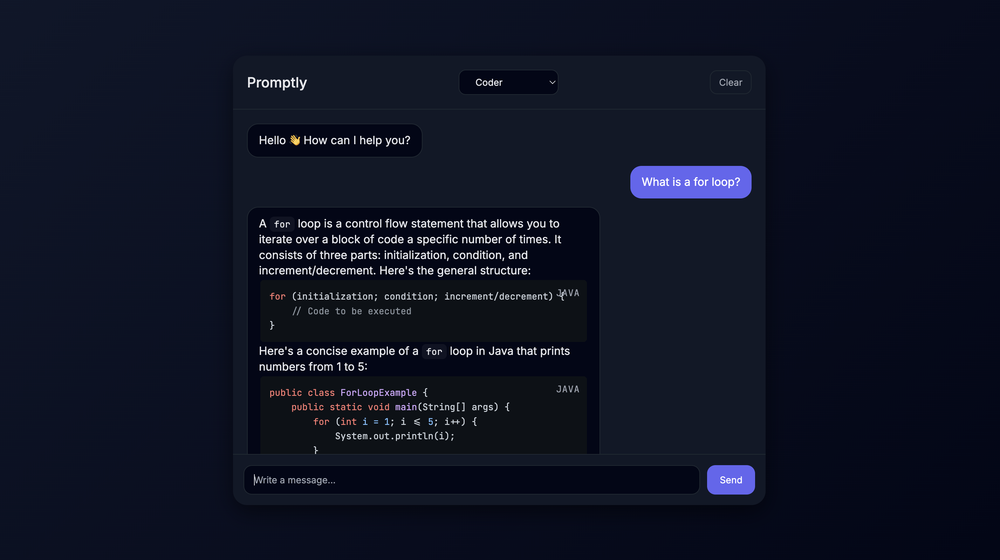

# Promptly

A Spring Boot middleware service that connects users to external AI APIs via OpenRouter, with features like selectable personalities and conversation memory.

Built with **Java 25**, **Spring Boot 4**, **Maven**, and **OpenRouter**.



---

## Features

- **Minimalistic Chat UI**: Simple web interface for interacting with the AI.
- **RESTful API**: Clean API endpoints for integration.
- **Session-based Memory**: Maintains conversation context using unique session IDs.
- **Selectable Features and Personalities**: Choose between different AI behaviors (**Assistant**, **Coder**, **Ron Burgundy**).
- **Resiliency**: Automatic retry with exponential backoff for network errors and rate limits.
- **Thread-safe**: Robust session handling using `ConcurrentHashMap`.
- **API Documentation**: Integrated OpenAPI/Swagger UI.

---

## Requirements

- **Java 25**
- **Maven**
- **OpenRouter API Key**: Obtain one for free at [openrouter.ai](https://openrouter.ai).

---

## Setup & Running

### 1. Clone the repository
```bash
git clone https://github.com/simonforsberg/promptly.git
cd promptly
```

### 2. Configure Environment Variables
The application requires an `AI_API_KEY` to communicate with OpenRouter.

**Terminal:**
```bash
export AI_API_KEY=your_api_key_here
```

**IntelliJ IDEA:**
1. Go to `Run` -> `Edit Configurations`.
2. Select `PromptlyApplication`.
3. Add `AI_API_KEY=your_api_key_here` to **Environment variables**.

### 3. Run the application
**Maven Wrapper:**
```bash
./mvnw spring-boot:run
```

**IDE:**
Run the `PromptlyApplication` class directly.

### 4. Access the application
- **Chat UI**: [http://localhost:8080](http://localhost:8080)
- **Swagger Documentation**: [http://localhost:8080/swagger-ui.html](http://localhost:8080/swagger-ui.html)

---

## Configuration

You can override default settings in `src/main/resources/application.properties` or via environment variables:

| Property       | Environment Variable | Description              | Default                        |
|----------------|----------------------|--------------------------|--------------------------------|
| `ai.base-url`  | `AI_BASE_URL`        | LLM provider base URL    | `https://openrouter.ai/api/v1` |
| `ai.api-key`   | `AI_API_KEY`         | OpenRouter API key       | *(required)*                   |
| `ai.model`     | `AI_MODEL`           | AI model to use          | `openai/gpt-4o-mini`           |
---

## Personalities

The `personality` field in the API request changes the system prompt:

| Key            | Role           | Behavior                                          |
|----------------|----------------|---------------------------------------------------|
| `assistant`    | Assistant      | Helpful and supportive assistant, answers clearly and concisely. |
| `coder`        | Java Developer | Coding assistant and Java specialist, gives technical advice. |
| `ron-burgundy` | Ron Burgundy   | Chat with the legendary news anchor. Stay classy! |

---

## API Reference

### Chat Endpoint
`POST /api/v1/chat`

**Request Body:**
```json
{
  "sessionId": "unique-session-id",
  "personality": "ron-burgundy",
  "message": "Who are you?"
}
```

**Success Response (200 OK):**
```json
{
  "sessionId": "unique-session-id",
  "reply": "I don't know how to tell you this, but I'm kind of a big deal."
}
```

**Error Response (400 Bad Request):**
```json
{
  "timestamp": "2026-05-08T17:25:00Z",
  "status": 400,
  "error": "Bad Request",
  "message": "message: must not be blank",
  "path": "/api/v1/chat"
}
```

**Error Response (503 Service Unavailable):**
Occurs when the AI service is unreachable after retries or when the circuit breaker is open.
```json
{
  "timestamp": "2026-05-08T17:25:00Z",
  "status": 503,
  "error": "AI Service Unavailable",
  "message": "AI service is currently unavailable. Please try again later.",
  "path": "/api/v1/chat"
}
```